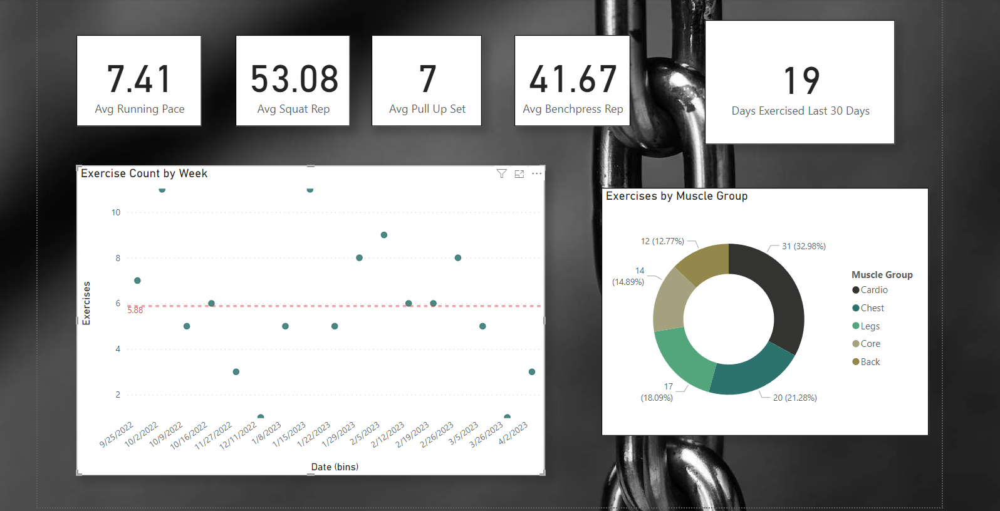
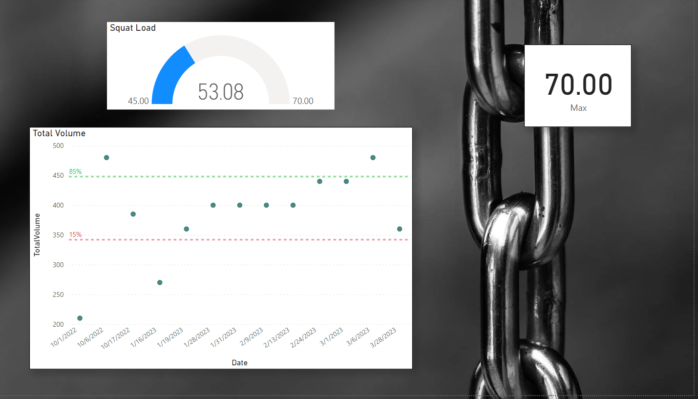

# NotionPull 
A script to pull from my exercise database from Notion App.  I intended this app to export data to a csv for viewing in Power BI.  
Very specific use-case  

## Project Description
This project uses Python requests library to pull from a data base using the Notion App api.  A Power BI report was created to visualize data.  Screenshots can be seen below of the end product.  

## If You Actually Use this.... 
If you somehow find yourself using this, the script requires a separate file named notionData.py.  In this file two variables should be created. 
1. auth: Your authentication code for Notion 
2. server:  The server id for your Notion database.
